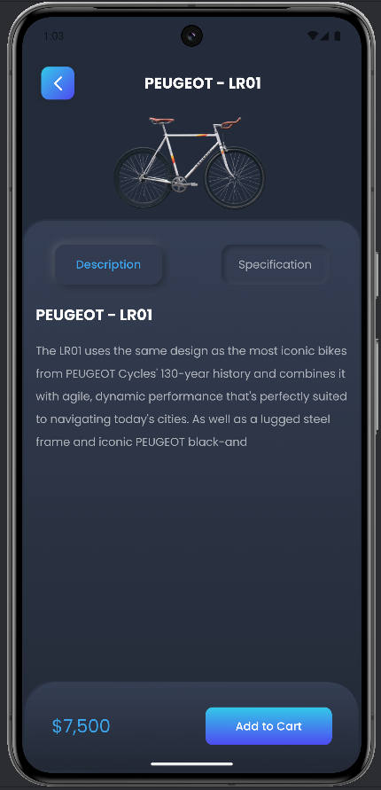

# Bike Shop App 🚴‍♂️

An Android Bike Shop application. This app allows users to browse and purchase bikes, view bike details, and manage their shopping cart (Complete Very soon:D)

## Demo 📱




## Getting Started 🚀

### Technologies Used 🛠️
- **Jetpack Compose** - Modern UI toolkit for Android
- **MVVM Architecture** - For separation of concerns and cleaner code
- **Retrofit** - For API calls to connect to the server
- **Kotlin Coroutines** - For asynchronous programming
- **Hilt** - For dependency injection

### Installation

1. **Clone the repository:**

   ```bash
   git clone https://github.com/aminrz3/BikeShopApp-Android
   cd BikeShopApp-Android

2. **API Setup** 🔌 :

   ```bash
   open file app/src/main/java/amin/rz3/bikeshoppingapp/data/ApiUrl.kt
   const val BASE_URL = "Your Api Url"


### License 📄
This project is licensed under the MIT License - see the [LICENSE](LICENSE) file for details.
